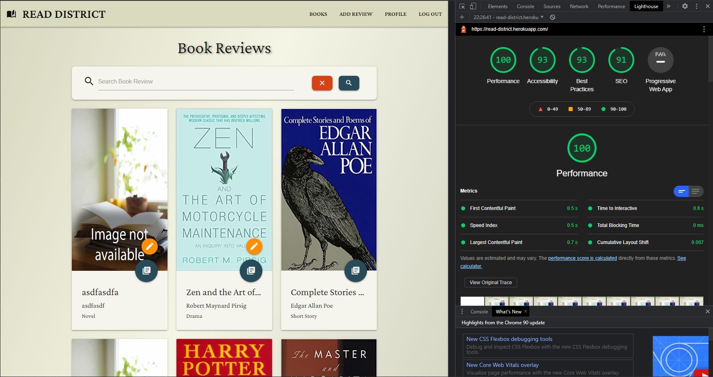
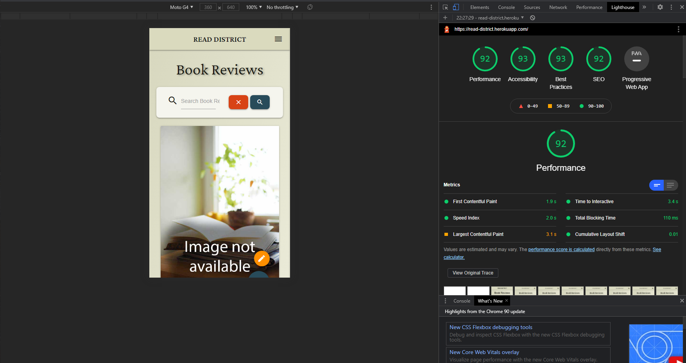

# Read District #

[README.md file](https://github.com/NicolaLampis/read-district/blob/master/README.md)

[View the live project here.](https://read-district.herokuapp.com/)

## Testing

## Functional User Test ##

I proceeded with the manual test considering every part of the web-app, every page and the scenarios a user could run.
The list of tests were ordered by pages and functionality. The tests were performed with a user logged in or not on the app.

- Navbar:
    - logo link redirect to books page.
    - small and medium size screen menu collapse, burger icon trigger the opening of right side navigation menu. Animation works fine.
    - medium size screen display book icon and logo in the central position.
    - small size screen display the logo without the left icon.
    - all screen size, all links work.

- Flash messages:
    - flash messages are correctly displayed for all screen size and different browsers.

- Footer:
    - on the bottom of the pages.
    - on the bottom of error pages.
    - link open a new tab to mine GitHub.
    - now is displayed correctly in different browsers.

- Books page:
    - Cards:
        - Hover animation correctly displayed.
        - You can see all the books rendered inside cards in order from the recent added to the first added.
        - Title, author and genre correctly displayed and truncate to the end of the line.
        - Broken images are correctly displayed as dummy-image.
        - Title link led to the correct book page.
        - Image link led to the correct book page.
        - Flat round button led to the correct book page. Button wave animation.
        - If the user is the writer of the review a second orange button shows up with and edit icon. Redirect to book page.
    - Search bar:
        - Cancel button clear the search and redirect to the books page. No button wave animation, hover shadow animation.
        - Search button submit correctly the search and let display the results.
        - Search empty form, trigger a message because the value is requested.
        - Fixed bug, after a search action and refresh the page will display the same search.
    
- Register:
    - Flash message 'Registration Successful!'.
    - Redirect profile page (Jinja2 display text 'No review found').
    - Form. Username, Password(secret characters) and email are requested input. Fill all input to be able to submit.
    - Input data are created in the **users** collection in the database.

- Log In:
    - Flash message 'Welcome, *username*'.    
    - Form. Username and Password(secret characters) are requested input. Fill all input to be able to submit.
    - If username is wrong, a flash message shows 'Incorrect Username and/or Password'.
    - If password is wrong, a flash message shows 'Incorrect Username and/or Password'.
    - Redirect to profile page if username and password are correct.

- Profile:
    - Correct profile name displayed.
    - Cards display all the reviews of this user. If the user have no reviews, instead of cards, a new block display the text 'No review found'.
    - Title, author and genre correctly displayed and truncate to the end of the line.
    - Cards hover animation correctly displayed.
    - Review button redirect to the correct book page. Button wave animation.
    - Without cookies the app will be logged out, and will redirect you to login page in case of edit/delete/add.

- Log Out:
    - Flash message 'You have been logged out'
    - Redirect to Log In
    - Navbar shows different navigation links (books, log in and register)

- Book Page with review:
    - Card display all the informations and text review.
    - If the user is the writer of the review tow buttons are displayed (Edit/Delete).
    - Edit button redirect to edit page.
    - Delete button opens a modal window that ask confirmation of deletion. Correct name of book displayed.
        - Cancel button closes the modal window without deletion.
        - Delete button delete the review and the info about the book from the database.

- Delete:
    - Flash message 'Review Successfully Deleted'.
    - Redirect to books page.

- Edit book:
    - All the values of the input form are filled with the courrent data from the correct id object.
    - Changes are correctly updated in the database.
    - Form. All the input element are requested input. All input must be filled to be able to submit.
    - Number input accept only integers, select input accept only one option.
    - Text input accept a number of characters from 100 to 900. Character counter at the right bottom of input window display correctly the count.
    - Cancel button redirect to books page.
    - Submit review upload the changes correctly, redirect to books page and show the flash message 'Review Successfully Updated'.

- Add Review:
    - Form. All the input element are requested input. All input must be filled to be able to submit.
    - Number input accept only integers, select input accept only one option.
    - Text input accept a number of characters from 100 to 900. Character counter at the right bottom of input window display correctly the count.
    - Add New Review button create a new object in the database, redirect to books page and show the flash message 'Review Successfully Added'.

- 404, 500, 503 error pages
    - Button redirect to book review.
    - 404 error page trigger correctly when the page is not found.
    

## Automated Test ##

Validation tools used to check the validity of the website code.

- [W3C Markup Validator](https://validator.w3.org/)
- This validator checks the markup validity of Web documents in HTML, XHTML, SMIL, MathML, etc.
  - The errors result from the Jinja2 templating language. No other error shown.
  - Secondary templates are extension of the base.html code, but again errors result from Jinja2 templating language.

- [W3C CSS Validation Service](https://jigsaw.w3.org/css-validator/)
- This validator checks the validity of cascading style sheets (css) and (X)HTML documents with style sheets.
    - Validation W3C of stylesheet (CSS) for TextArea (CSS versione 3 + SVG). No error found.

- [PEP8 Online validation](http://pep8online.com/checkresult)
- Validity of Python code against the PEP8 requirements.
    - Check results: No errors.

- [Chrome DevTools Lighthouse](https://developers.google.com/web/tools/lighthouse)
- An open-source automated tool for improving webpages by running audits for performance, accessibility, progressive web apps, SEO etc.

  - Desktop Performance
    
  
  - Mobile Performance
    

This project was tested across multiple browsers (Chrome, Opera, Brave, Firefox, and Edge) in different simulated and real devices.
